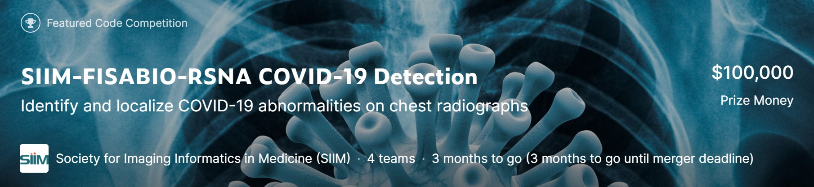

# SIIM-FISABIO-RSNA-COVID-19-Detection

## コンペについて

<b>Schedule</b> 

コンペ開始:2021年5月17日 
Submit期限:2021年8月2日 
Winner's Showcase:2021年9月19-20日 

<b>Overview</b> 

maskされた胸部レントゲン写真から患者が肺炎が陰性かどうか，その他3つのラベルを予測するObject-Detection &Multi-Classification 問題．

- train_study_level.csv: 研究のメタデータ．
- train_image_level.csv: 画像用メタデータ．辞書形式のバウンディングボックス座標データ，不透明度のラベル．
- sample_submission.csv: 提出例．
- train folder: DICOM形式の胸部レントゲン写真（6,334枚）．
- test folder: train dataとほぼ同じ規模のデータセット．バウンディングボックスの座標なし. 

|Name|Description|
|---|---|
|Negative for Pneumonia|肺炎が陰性かどうか|
|Typical Appearance|典型的な外観(直訳).|
|Indeterminate Appearance|不確定な外観(直訳).|
|Atypical Apperance|非定形の外観(直訳)|

# Log

### 0519

<b>Join the competition</b>

Done
- とりまどういうコンペなのか確認.
- [001_EDA.ipynb](./EDA/001_EDA.ipynb)動かしてみた.
- Discussion一通り確認.

Memo
- 初コンペで緊張する.画像検知モデルはコードが複雑なので他人のを真似する.
- まだモデルについてのcodeがないので,YOLOv5を使用する
.